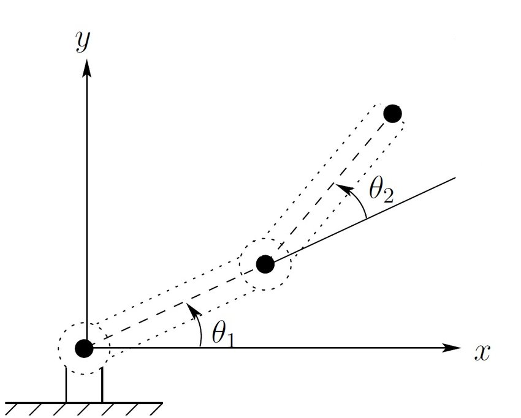

# Lab 3: 2-DoF Robot Pt.2

2.12/2.120 Intro to Robotics  
Spring 2024[^1]

- [1 Validate Hardware Setup](#1-validate-hardware-setup)
  - [1.1 Validate Encoders](#11-validate-encoders)
  - [1.2 Validate Motors](#12-validate-motors)
  - [1.3 Validate Joystick](#13-validate-joystick)
- [2 Potentiometers](#2-potentiometers)
  - [2.1 Wire Potentiometers](#21-wire-potentiometers)
  - [2.2 Read Potentiometers](#22-read-potentiometers)
- [3 Forward Kinematics](#3-forward-kinematics)
- [4 Validate Serial Read](#4-validate-serial-read)
- [5 Tune PID Using Potentiometers](#5-tune-pid-using-potentiometers)
  - [5.1 Constant Setpoint](#51-constant-setpoint)
  - [5.2 Step Response in Joint Space](#52-step-response-in-joint-space)
- [6 Inverse Kinematics](#6-inverse-kinematics)
- [7 Cartesian Space](#7-cartesian-space)
  - [7.1 Horizontal Line](#71-horizontal-line)
  - [7.2 Vertical](#72-vertical)
  - [7.3 Joystick](#73-joystick)
- [8 Feedback Form](#8-feedback-form)

## 1 Validate Hardware Setup
Estimated time of completion: 10 min

### 1.1 Validate Encoders
Run `test_code/encoder_test.cpp` to validate your encoder setup. Remember to open the Serial Monitor to see the output. Make sure that both the direction and the magnitude make sense!

### 1.2 Validate Motors
Run `test_code/motor_drive_test.cpp` to validate your motor setup. You should see both motors oscillating back and forth.

### 1.3 Validate Joystick
Run `lab_code/joystick.cpp` and `test_code/joystick_test.cpp` to validate your joystick setup.

## 2 Potentiometers
Estimated time of completion: 25 min

### 2.1 Wire Potentiometers

We will be using potentiometers to quickly and easily tune our PID controller without having to constantly reupload code. First, please wire 3 potentiometers to your microcontroller.

    
<i> What is a potentiometer?</i>
    

  A potentiometer is an electrical component that functions as a variable resistor or a voltage divider. It consists of a resistive element, such as a carbon track, and a movable wiper contact that slides along the element. By moving the wiper, you can change the resistance between the wiper and each end of the track, which allows you to adjust the level of current flowing through a circuit, or to change the voltage at the wiper, which can be used to control various devices such as the volume on a radio or the position of a servo motor in robotics.
  

### 2.2 Read Potentiometers
Complete the `TODO`s in `include/pinout.h`, `include/potentiometer.h` and `lab_code/potentiometer.cpp`. To validate your code, run `lab_code/potentiometer.cpp` and `test_code/potentiometer_test.cpp`.

## 3 Forward Kinematics
Estimated time of completion: 10 min

First, derive the forward kinematic equations for a 2-DoF arm. In other words, derive equations for `x` and `y` in terms of <code>Θ1</code> and <code>Θ2</code>.

<i> What is forward kinematics? </i>

Forward kinematics answers the question, "Given the angles of the robot's joints, what are the x, y coordinates of the robot's hand?" For more, refer to lecture 2!

To validate your derived equations, first move your robotic arm to the angles `(pi/2, 0)` (pointing straight forward). Then, run `lab_code/kinematics.cpp` and `test_code/forward_kinematics_test.cpp`. You should see the Serial Monitor printing the `x` and `y` real-life coordinates of the marker holder in centimeters (e.g. at the angle `(pi/2, 0)`, `x=0` and `y~=38`).

## 4 Validate Serial Read
Estimated time of completion: 10 min

## 5 Tune PID Using Potentiometers
Estimated time of completion: 20 min

We will be using the file `lab_code/pid_tune.cpp` to tune our PID controller.

### 5.1 Constant Setpoint
First, define the setpoint to be `(pi/2, 0)` in joint space by uncommenting `#define Constant` and commenting out `#define SquareWave`. Then, use the potentiometers to change the PID gains. If your PID controller is properly tuned and you disturb the arm in any direction, the arm should quickly return to the setpoint `(pi/2, 0)` with minimal overshoot, oscillations, and steady state error. You can validate the response using Serial Read.

### 5.2 Step Response in Joint Space
Once the PID controller is properly tuned to follow a constant setpoint, the next step is to follow a square wave in joint space by commenting out `#define Constant` and uncommenting `#define SquareWave`. Once again, the step response should have minimal overshoot, oscillations, and steady state error.

## 6 Inverse Kinematics
Estimated time of completion: 10 min

Using the forward kinematic equations you found, derive the inverse kinematic equations for a 2-DoF arm. In other words, derive equations for <code>Θ1</code> and <code>Θ2</code> in terms of `x` and `y`.

<i> What is inverse kinematics? </i>

It's the opposite of forward kinematics!
Put simply, forward inverse kinematics answers the question, "Given the desired x,y coordinates of the robot's hand, what should the angles of the robot's joints be?" For more, refer to lecture 2!

Then, translate your derived equations into code by completing the `TODO 2`s in `kinematics.cpp`.

To validate your derived equations, run `lab_code/kinematics.cpp` and `test_code/inverse_kinematics_test.cpp`. You should see `theta1_error` and `theta2_error` be 0.

## 7 Cartesian Space
Estimated time of completion: 10 min

Now that we tuned our PID controller and implemented inverse kinematics, we can follow any trajectory we want in Cartesian space!

### 7.1 Horizontal Line
Set the setpoint to be a horizontal line in Cartesian space.

### 7.2 Vertical 
Set the setpoint to be a vertical line in Cartesian space.

### 7.3 Joystick
Set the setpoint to be the reading from your joystick.

## 8 Feedback Form

Before you leave, please fill out https://tinyurl.com/212-feedback. 

| :white_check_mark: CHECKOFF X :white_check_mark:   |
|:---------------------------------------------------|
| Show the feedback form completion screen to a TA or LA. |

[^1]: Version 1 - 2024: Jinger Chong, Josh Sohn
